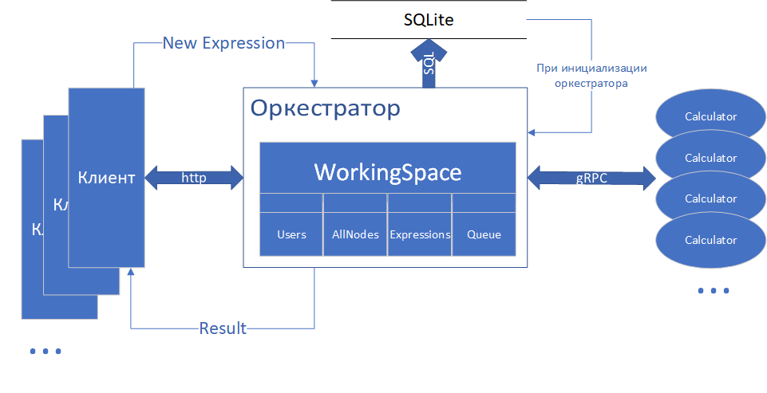

# arithmometer
@VladimirViSi (telegram)

Сервис предназначен для выполнения расчетов выражений, состоящих из простых арифметических операций.
Длительноть выполнения единичных операций задает клиент.

## Основная логика работы
Оркестратор хранит текущее состояние объектов в базе данных SQLite (в очереди сохраняется 
только список всех узлов очереди.

При каждом запуске оркестратор загружает из базы данных сохраненные объекты, что позволяет 
реализовать восстановление работоспособности.


Вычислитель периодически отправляет запросы оркестратору для получения задачи, оркестратор
дает задачу из очереди задач (если она не пустая), устанавливая дедлайн в х1.5 времени выполнения
операции. Вычислитель вычисляет задачу и возвращает оркестратору результат.
Полученный результат оркестратор заносит в узел выражения и обновляет его родителя.
При выполнении задачи оркестратором, задача удаляется из очереди, если задача является корнем выражения,
либо результата содержит деление на ноль, обновляется выражение, и удаляеются оставшиеся в очереди 
задачи выражения.

Реализована проверка деления на 0, вычислитель возвращает ошибку.

После каждого изменения объектов оркестратора, изменения сохраняются в базе данных.

Выражение парсится через постфиксную запись.


### Требования к входным данным
1. Принимаемое выражение должно состоять из чередующихся последовательно чисел и операторов: )(+-*/
2. Пробелы между символами могут присутствовать.
3. Первое число в выражении может быть отрицательным. 
4. В скобках первое число __не должно быть отрицательным__.
5. В операторах умножения число __не может быть отрицательным__.


## API
HTTP сервер работает по адресу __"localhost:8000"__
gRPC сервер работает по адресу __"localhost:5000"__
_возможна настройка через configs_

Примеры запросов лежат в папке [examples](./examples) проекта

Выражение передается клиентом POST запросом по адресу
__http://127.0.0.1:8000/newexpression__

В теле запроса передается JSON со строкой выражения и таймингами операций в секундах.
```json
{
"Expression":     "-1+(2-3)/4+5",
"Timings":        {"plus":1,"minus":1,"mult":1,"div":1},
}
```

Клиенту возвращается id выражения.
Если не передавать выражение (поле Expression с пустой строкой) выполнится обновление 
только таймингов операций.

Клиент спрашивает о завершении расчетов передавая id выражения в Get запросе и
получает ответ. Если id неправильный, сервер сообщит об этом. 
например 
```bash
curl -v http://127.0.0.1:8000/getresult?id=146
```
(в конце - id выражения(меняется))

Если не указать id оркестратор вернет все имеющиеся выражения
```bash
curl -v http://127.0.0.1:8000/getresult?id=
```


## Запуск
Запускать все из папки arithmometer_v2

#### Запуск сервера
```bash
go run ./cmd/orch/
```
запуск с агрументом "new" создаст новую базу данных
```bash
go run ./cmd/orch/ new
```


#### Запуск вычислителя

```bash
go run ./cmd/calculator/
```

Сколько раз запустить, столько и будет вычислителей. Запускать либо в фоне, либо
в отдельных сеансах командной строки

#### Автоматизация запуска окружения
```bash
go run .\cmd\start\ 3
```
В виде параметра (3) принимает количество калькуляторов


#### Запуск клиента для тестирования
Для удобства тестирования сделан клиент. 
Тайминги в клиенте можно поменять в исходном коде [строка 23](./client/client.go)

```bash
go run ./client/
```
Клиент первым параметром может принимать строку выражения, вторым параметром тайминг (единый для всех операций).
```bash
go run ./client/ "(3 * 5 - 6 /587 * (56 -42))* 95" 5
```
```text
Получение результата
Status: 200 OK  Body:   (3 * 5 - 6 /587 * (56 -42))* 95 = 1411.405451

```

#### Запуск интеграционных тестов
```bash
go test ./cmd/test/
```
Отрабатывают где-то за полминуты. Запускают все сервисы и прогоняют по ним тестовые выражения с сравнением результатов и 
должных значений

## Ошибки, недоделки
* не реализована авторизация и аутиндификация пользователей

## Соответствие критериям
* Весь реализованный ранее функционал работает как раньше, только в контексте конкретного пользователя.
  - __в работе__
* У кого выражения хранились в памяти - переводим хранение в SQLite. (теперь наша система обязана переживать перезагрузку)
  - __реализовано__
* У кого общение вычислителя и сервера вычислений было реализовано с помощью HTTP - переводим взаимодействие на GRPC
  - __реализовано__

### Дополнительные баллы:
- за покрытие проекта модульными тестами можно получить бонусные 10 баллов 
  - __реализовано частично__
- за покрытие проекта интеграционными тестами можно получить бонусные 10 баллов 
  - __реализовано__


## Схема работы


## Examples

[Отправить выражение](./examples/post.http)

[Получить результат](./examples/get.http)

_В папке distributive находятся исполняемые файлы оркестратора и калькулятора 
(скомпилированы для Win 64 bit). Рядом с оркестратором должна находится папка db._
Команды для компиляции исполняемых файлов:
```bash
go build ./cmd/orch/
```
```bash
go build ./cmd/calculator/
```